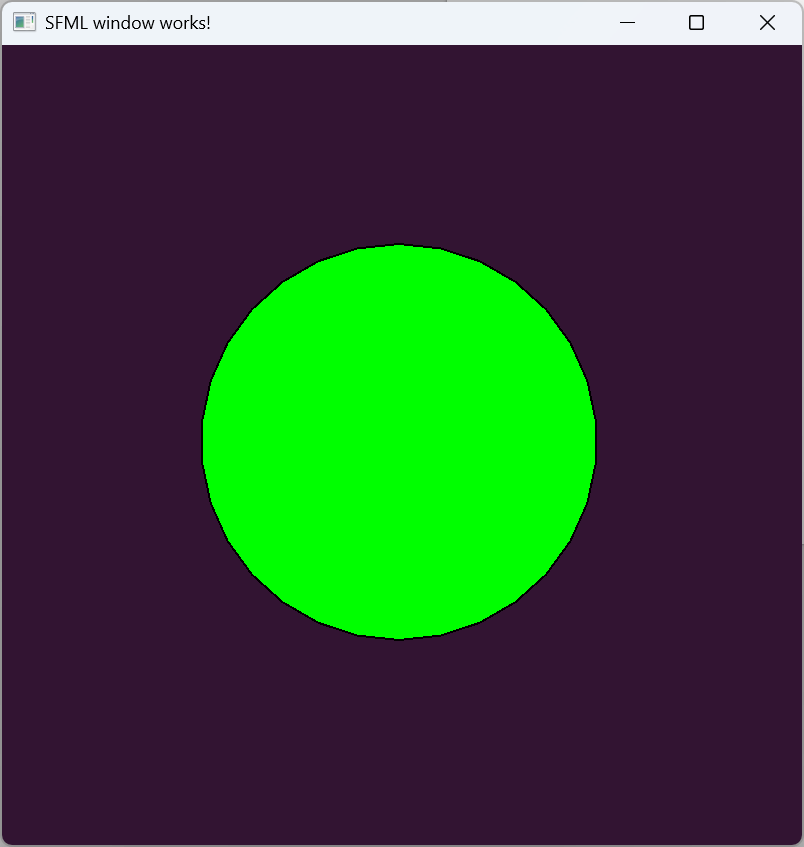

This is the test project explaining how to use SFML (Simple and Fast Multimedia Library) in your VS Code C++ projects.

Firstly, you'll have to download SFML Visual C++ 17 (2022) from the official page:

https://www.sfml-dev.org/download/sfml/3.0.0/

I used this archive: [SFML-3.0.0-windows-vc17-64-bit.zip](https://www.sfml-dev.org/files/SFML-3.0.0-windows-vc17-64-bit.zip)

In order for this C++ program (main.cpp) to be compiled to main.exe (Executable file), you'll have to add SMFL lib in include paths to .bat files:

```console
build-debug.bat

build-release.bat
```

I defined to environmental vars in both these files:

```console
set SZ_SFML_ROOT=D:/SDK/SFML3

set SZ_SFML_ROOTDLL=D:\SDK\SFML3\bin
```
So, your [SFML-3.0.0-windows-vc17-64-bit.zip](https://www.sfml-dev.org/files/SFML-3.0.0-windows-vc17-64-bit.zip) should be unpacked to **D:\SDK\SFML3** dir.

Now, the include files from `"D:/SDK/SFML3/include/**"` that are defined in your **Test_SFML\.vscode\c_cpp_properties.json** will be used correctly.

So that you can define header files in your main.cpp like below:
```c++

#include <SFML/Graphics.hpp>

```

After compiling main.cpp and launching main.exe from bin\ folder, here is what you should get on your screen:


Also you can compile and download using GiHub action (example: https://github.com/Andycar/Test_SFML/actions/runs/14667575557)

For further reading, refer to excellent sources here:
https://github.com/SFML/SFML-Game-Development-Book/tree/master
